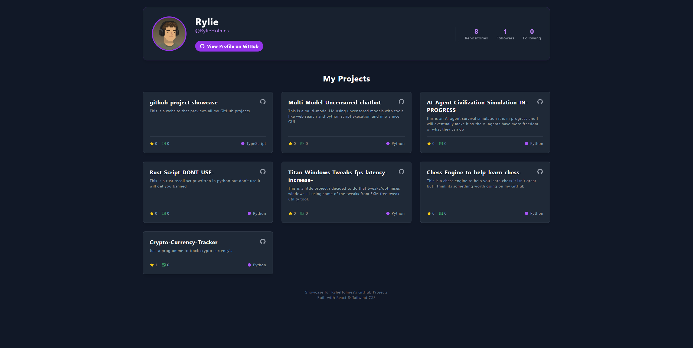

# GitHub Project Showcase

<div align="center">
  <p>
    <strong>A dynamic and visually appealing portfolio to display your GitHub projects, built with React, TypeScript, and Tailwind CSS.</strong>
  </p>
</div>

<br>

## About The Project

I wanted a more visually engaging way to display my GitHub projects than the standard profile page. This showcase application was built to solve that problem. It fetches my profile information and repositories directly from the GitHub API and presents them in a clean, modern, and interactive interface.

The goal was to create a single-page application that is not only functional but also fast and beautiful, providing a great user experience for anyone interested in exploring my work.

<br>

###   Key Features

*   **Dynamic User Profile:** Automatically fetches and displays the latest user information from GitHub, including avatar, bio, and follower stats.
*   **Interactive Project Grid:** Repositories are displayed in a responsive grid layout with project cards that highlight key information like stars, forks, and the primary language.
*   **Detailed Project View:** Clicking on any project opens a detailed view that fetches and renders the project's `README.md` file, sanitized and styled for readability.
*   **Live Python Code Execution:** For Python-based projects, a built-in code runner powered by **Pyodide** allows you to execute the main Python file directly in the browser!
*   **Clean & Modern UI:** Styled with Tailwind CSS for a sleek, dark-mode aesthetic that is fully responsive and looks great on any device.
*   **Error Handling & Loading States:** Ensures a smooth user experience, even when the GitHub API is slow or returns an error.

<br>

###   Live Demo

**[https://rylieholmes.github.io/github-project-showcase/]**

<br>

###   Screenshots



<br>

##   Tech Stack

This project was built using a modern frontend stack:

*   **Core:** [React](https://reactjs.org/) & [TypeScript](https://www.typescriptlang.org/)
*   **Build Tool:** [Vite](https://vitejs.dev/)
*   **Styling:** [Tailwind CSS](https://tailwindcss.com/)
*   **Markdown Rendering:** [Marked](https://marked.js.org/) & [DOMPurify](https://github.com/cure53/DOMPurify)
*   **In-Browser Code Execution:** [Pyodide (WebAssembly)](https://pyodide.org/)

<br>

##   Getting Started

To get a local copy up and running, follow these simple steps.

### Prerequisites

Make sure you have Node.js and npm installed on your machine.
*   [Node.js](https://nodejs.org/en/) (which includes npm)

### Installation & Setup

1.  **Clone the repository:**
    ```sh
    git clone https://github.com/your-username/github-project-showcase.git
    ```2.  **Navigate to the project directory:**
    ```sh
    cd github-project-showcase
    ```3.  **Install NPM packages:**
    ```sh
    npm install
    ```
4.  **Run the development server:**
    ```sh
    npm run dev
    ```
    Your application should now be running on `http://localhost:5173/` (or another port if 5173 is busy).

<br>

### Configuration

To showcase your own GitHub projects, you just need to change one line of code!

*   Open the `src/App.tsx` file.
*   Find the `GITHUB_USERNAME` constant on line 11 and replace `'RylieHolmes'` with your own GitHub username.

```typescript
// src/App.tsx

const GITHUB_USERNAME = 'YourGitHubUsernameHere'; // <-- Change this value
```

<br>

##   Future Improvements

While the project is fully functional, here are some ideas for future enhancements:

- [ ] Add a search and filter bar to easily find specific repositories.
- [ ] Implement a theme switcher (e.g., light mode).
- [ ] Expand the Code Runner to support other languages like JavaScript.
- [ ] Add pagination for users with more than 100 repositories.

<br>

##   License

Distributed under the MIT License. See `LICENSE` for more information.
